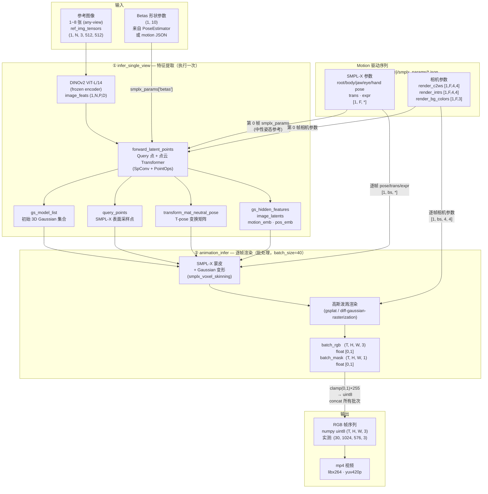

# Deployment Notes

本文档记录 LHM++ 在本地 Mac 与华为云 GPU 远程主机上的部署、同步和调试经验。新的环境问题、模型/数据同步路径和验证命令应持续追加到这里。

## 推理流程概览

### 输入

| 类型 | 说明 |
|------|------|
| 参考图像 | **1~8 张**，shape `(N, 3, 512, 512)`，支持单张或多视角（模型名 "any-view" 即来源于此） |
| Betas 形状参数 | `(1, 10)`，优先来自 Pose Estimator（`engine/pose_estimation/pose_estimator.py`）对参考图的预测；若跳过 Pose Estimator 也可直接使用 motion JSON 里预存的 betas |
| Motion 驱动序列 | 来自 `motion_video/{name}/smplx_params/*.json` 预处理数据，每帧一个 JSON，包含完整 SMPL-X 参数和相机参数 |

### Motion 序列结构（`prepare_motion_seqs_eval` 返回）

```
motion_seqs
├── smplx_params               每帧身体参数，shape [1, F, *]
│   ├── root_pose              全局旋转        [1, F, 3]
│   ├── body_pose              身体关节        [1, F, 69]
│   ├── jaw_pose               下颌            [1, F, 3]
│   ├── leye_pose / reye_pose  眼睛            [1, F, 3]
│   ├── lhand_pose/rhand_pose  双手            [1, F, 45]
│   ├── trans                  全局平移        [1, F, 3]
│   ├── expr                   表情系数        [1, F, 100]  ← 来自 FLAME 参数
│   ├── focal / princpt        相机内参        [1, F, 2]
│   ├── img_size_wh            图像尺寸        [1, F, 2]
│   └── betas                  形状参数        [1, 10]      ← 所有帧共享
├── render_c2ws                渲染相机外参     [1, F, 4, 4]
├── render_intrs               渲染相机内参     [1, F, 4, 4]
├── render_bg_colors           背景颜色        [1, F, 3]
├── masks                      前景掩码列表     list[PIL]
├── offset_list                裁剪偏移        list[(sx, sy, ox, oy)]
└── ori_size                   原始渲染分辨率   (H, W)
```

### 推理流程图



### 各阶段输出汇总

| 阶段 | 输出 | Shape / 类型 | 说明 |
|------|------|-------------|------|
| `infer_single_view` | `gs_model_list` | list | 初始 3D Gaussian 参数 |
| `infer_single_view` | `query_points` | Tensor | SMPL-X 表面查询点 |
| `infer_single_view` | `transform_mat_neutral_pose` | Tensor | T-pose → 当前 pose 变换 |
| `infer_single_view` | `gs_hidden_features`, `image_latents`, `motion_emb`, `pos_emb` | Tensor | 跨帧复用的隐空间特征 |
| `animation_infer` | `batch_rgb` | `(T,H,W,3)` float | 渲染 RGB，值域 [0,1] |
| `animation_infer` | `batch_mask` | `(T,H,W,1)` float | 前景掩码，值域 [0,1] |
| `inference_results` | RGB 帧序列 | `(T,H,W,3)` uint8 | 最终帧，值域 [0,255] |
| 写盘 | mp4 视频 | 文件 | libx264，yuv420p |

> **注**：`infer_unified.py` 的 `inference_video_mode` 还会在 `exps/reattached/` 下额外创建 `gt/` 和 `mask/` 目录，并可选保存拼接视图；`app.py` 只保存最终 mp4 和输入图快照（`raw.png`）。

---

## 工作流约定

- 本地 Mac：主代码仓库、文档维护、git 操作、模型/数据长期备份。
- 华为云远程：CUDA/GPU 调试、推理验证、长时间任务运行。
- 代码同步：使用 git 在本地与远程之间同步源码。
- 大文件同步：使用 remote ssh 工具传输模型、数据、motion assets、实验输出和环境备份。
- 大文件存放：不要提交到 git；若必须放在项目树内，先确认 `.gitignore` 已覆盖。

## 推荐目录

| 类型 | 推荐位置 | 说明 |
| --- | --- | --- |
| 本地仓库 | `/Users/hammer/workspace/LHM-plusplus` | 主代码与文档工作区 |
| 本地模型备份 | 项目外或已忽略的 `pretrained_models/` | 必须长期保留 |
| 本地 motion 备份 | 项目外或已忽略的 `motion_video/` | demo/测试所需 |
| 远程工作区 | `~/workspace/hanmo/` | 远程 git checkout 与调试 |
| 远程持久存储 | `/temp/hanmo/` | 可跨节点保留的大文件副本 |
| 远程临时 scratch | `/cache/hanmo/` | 可重建缓存和临时输出 |

## 代码同步记录模板

```text
日期：
本地分支/commit：
远程主机：
远程仓库路径：
同步命令：
远程状态检查：
备注：
```

建议流程：

```bash
# local
git status --short
git add <files>
git commit -m "<message>"
git push

# remote
git fetch
git checkout <branch-or-commit>
git pull
```

## 大文件同步记录模板

```text
日期：
资产类型：model / dataset / motion_video / output / env_backup
来源：
本地备份路径：
远程路径：
传输工具：ssh_upload_bg / ssh_download_bg / ssh_upload / ssh_download
校验方式：文件数量 / du -sh / checksum / 抽样读取
是否可重下：
备注：
```

注意：

- 模型和数据必须在本地留备份，远程不能作为唯一副本。
- 上传到远程后，优先放入 `/temp/hanmo/`；只有可重建或短期使用的内容放入 `/cache/hanmo/`。
- 大目录传输完成后记录 `du -sh`、文件数量或 checksum，避免半截同步导致后续调试误判。

## 环境搭建记录模板

```text
日期：
远程主机：
GPU/CUDA：
Python：
Conda env：
PyTorch / torchvision / xformers：
关键 wheel：
安装命令：
失败现象：
解决方式：
本地备份材料：
备注：
```

本项目重点确认：

- Python 3.10
- CUDA 12.1
- PyTorch 2.3.0 / torchvision 0.18.0 / torchaudio 2.3.0
- `xformers==0.0.26.post1`
- `spconv-cu121`
- `torch_scatter`、`pytorch3d`、`gsplat` 与 PyTorch/CUDA/Python 版本匹配
- `lib/pointops`、`diff-gaussian-rasterization`、`simple-knn` 是否编译安装成功

## 2026-05-01 远程环境首轮搭建记录

```text
日期：2026-05-01
远程主机：30201（华为云 A100）
GPU/CUDA：NVIDIA A100-SXM4-80GB, driver 535.183.01；系统同时有 CUDA 12.1/12.8，编译时显式使用 /usr/local/cuda-12.1
远程代码：/home/ma-user/workspace/hanmo/LHM-plusplus，main@6fa576c
Conda env：/cache/hanmo/conda-envs/lhmpp_py310_cu121
Python：3.10.20
PyTorch：torch 2.3.0+cu121 / torchvision 0.18.0+cu121 / torchaudio 2.3.0+cu121 / xformers 0.0.26.post1
环境大小：约 8.8G；远程 pip cache 基本为空
本地备份材料：
  docs/envs/lhmpp_py310_cu121_30201_20260501_conda_env.yml
  docs/envs/lhmpp_py310_cu121_30201_20260501_pip_freeze.txt
```

关键安装顺序：

```bash
# remote
conda create -p /cache/hanmo/conda-envs/lhmpp_py310_cu121 python=3.10 pip -y
export PYTHONNOUSERSITE=1
export PIP_CACHE_DIR=/cache/hanmo/pip-cache
export TMPDIR=/cache/hanmo/tmp

/cache/hanmo/conda-envs/lhmpp_py310_cu121/bin/python -m pip install \
  torch==2.3.0 torchvision==0.18.0 torchaudio==2.3.0 \
  --index-url https://download.pytorch.org/whl/cu121
/cache/hanmo/conda-envs/lhmpp_py310_cu121/bin/python -m pip install \
  xformers==0.0.26.post1 --index-url https://download.pytorch.org/whl/cu121
```

基础依赖处理：

- `requirements.txt` 里先排除 `torch` / `torchvision` / `torchaudio` / `xformers` / `gsplat`，避免覆盖已安装的 CUDA wheel。
- `chumpy` 在 PEP517 build isolation 里会失败，报 `ModuleNotFoundError: No module named 'pip'`；解决方式：

```bash
/cache/hanmo/conda-envs/lhmpp_py310_cu121/bin/python -m pip install setuptools==74.0.0 wheel
/cache/hanmo/conda-envs/lhmpp_py310_cu121/bin/python -m pip install --no-build-isolation chumpy
```

- 其余基础依赖使用过滤后的 requirements 安装；最终 resolver 选出 `numpy==1.23.0`、`scipy==1.13.1`、`opencv_python==4.11.0.86`、`opencv_python_headless==4.11.0.86`、`scikit-image==0.24.0`。
- `rembg` 需要额外安装 `rembg[cpu]==2.0.63`，否则 import 时缺 `onnxruntime`。

CUDA / ABI 相关包：

```bash
/cache/hanmo/conda-envs/lhmpp_py310_cu121/bin/python -m pip install spconv-cu121
/cache/hanmo/conda-envs/lhmpp_py310_cu121/bin/python -m pip install torch_scatter \
  -f https://data.pyg.org/whl/torch-2.3.0+cu121.html
/cache/hanmo/conda-envs/lhmpp_py310_cu121/bin/python -m pip install fvcore iopath
/cache/hanmo/conda-envs/lhmpp_py310_cu121/bin/python -m pip install --no-index --no-cache-dir pytorch3d \
  -f https://dl.fbaipublicfiles.com/pytorch3d/packaging/wheels/py310_cu121_pyt230/download.html
```

- `pytorch3d` 按 README 的 `--no-index` 安装会先缺 `fvcore`，需先从 PyPI 镜像补 `fvcore iopath`。
- `gsplat==1.4.0+pt23cu121` 的 wheel 实际从 GitHub release 下载，直连会卡住；开启远程 proxy 后安装成功，安装后已停止 proxy。

```bash
/cache/hanmo/conda-envs/lhmpp_py310_cu121/bin/python -m pip install \
  'gsplat==1.4.0+pt23cu121' -f https://docs.gsplat.studio/whl/gsplat/
```

源码编译扩展统一使用 CUDA 12.1：

```bash
export CUDA_HOME=/usr/local/cuda-12.1
export PATH=/usr/local/cuda-12.1/bin:$PATH
export LD_LIBRARY_PATH=/usr/local/cuda-12.1/lib64:${LD_LIBRARY_PATH:-}
export TORCH_CUDA_ARCH_LIST=8.0

/cache/hanmo/conda-envs/lhmpp_py310_cu121/bin/python -m pip install --no-build-isolation \
  git+https://github.com/ashawkey/diff-gaussian-rasterization/
/cache/hanmo/conda-envs/lhmpp_py310_cu121/bin/python -m pip install --no-build-isolation \
  git+https://github.com/camenduru/simple-knn/

cd /home/ma-user/workspace/hanmo/LHM-plusplus/lib/pointops
/cache/hanmo/conda-envs/lhmpp_py310_cu121/bin/python setup.py install
```

注意：

- `diff-gaussian-rasterization` 默认 build isolation 会因为隔离环境没有 `torch` 而失败，需 `--no-build-isolation`。
- `pointops` 编译成功，但因为 env 的 `ninja` 不在 PATH，构建时回退到 distutils；下次可把 `/cache/hanmo/conda-envs/lhmpp_py310_cu121/bin` 加到 PATH 以启用 ninja。
- `setup.py install` 会改写远程仓库里的 `lib/pointops/pointops.egg-info/PKG-INFO`，本次已恢复，远程 `git status --short` 为空。

验证结果：

```text
torch 2.3.0+cu121 cuda 12.1 available True
device NVIDIA A100-SXM4-80GB
OK rembg 2.0.63
OK spconv 2.3.8
OK torch_scatter 2.1.2+pt23cu121
OK pytorch3d 0.7.6
OK diff_gaussian_rasterization
OK simple_knn._C
OK gsplat 1.4.0+pt23cu121
OK pointops_cuda
torch_scatter CUDA smoke test: [3.0, 3.0]
```

残留事项：

- `python -m pip check` 只报 `decord 0.6.0 is not supported on this platform`，但 `import decord` 可成功，暂作为 metadata warning 记录。
- ~~尚未下载模型权重、motion assets 或数据~~ → 已完成，见下节。

## 2026-05-01 最小推理验证记录

```text
日期：2026-05-01
远程主机：30201（华为云 A100）
代码 commit：6fa576c (main)
模型路径：/temp/hanmo/models/lhm_plusplus/LHMPP-700M
         pretrained_models/ → symlink → /temp/hanmo/models/lhm_plusplus/LHMPP-Prior/
数据/输入路径：
  参考图像：assets/example_aigc_images/055330c0d988_000.jpg（512×512）
  motion：motion_video/Dance_I/（从 /temp/hanmo/lhmpp_transfer/lhmpp_motion_video_30426.tgz 解压）
运行命令：
  /cache/hanmo/conda-envs/lhmpp_py310_cu121/bin/python mini_infer.py
  （脚本位于项目根目录，日志 /cache/hanmo/logs/mini_infer.log）
输出路径：./debug/mini_infer_out.mp4（远程临时，可重建）
GPU 显存占用：Peak 18.3 GB / 80 GB
运行结果：
  frames=(30, 1024, 576, 3)  fps=15  端到端完成，视频写出成功
结论：模型加载 + 前向推理 + 动作序列渲染全部正常，环境可用
后续动作：
  - 如需复现，执行上述命令即可（dinov2 权重已缓存于 /cache/hanmo/torch/hub/checkpoints/）
  - mini_infer.py 已追踪进 git，可作为快速验证脚本复用
```

环境 & 依赖修复记录（推理验证过程中发现）：

- `scripts/inference/infer_unified.py` 顶层 import 有问题：`from core.runners.infer.utils import prepare_motion_seqs` —— 该函数不存在（只有 `prepare_motion_seqs_eval`），直接导入此文件会报 `ImportError`。**绕过方式**：不 import `infer_unified`，直接使用 `scripts/inference/app_inference.py` 的函数路径，见 `mini_infer.py`。
- `TORCH_HOME` 需与缓存路径匹配：脚本设 `TORCH_HOME=/cache/hanmo/torch`，dinov2 权重需放在 `/cache/hanmo/torch/hub/checkpoints/dinov2_vitl14_reg4_pretrain.pth`（已完成）。
- 模型加载前需调用 `accelerate.PartialState()` 初始化，否则 accelerate logging 报 `RuntimeError`。
- 推理前需设 `torch._dynamo.config.disable = True`，否则 dynamo 在 trace `self.encoder.patch_size` 时报 `InternalTorchDynamoError: patch_size`（与原始脚本行为一致）。

## 远程调试记录模板

```text
日期：
远程主机：
代码 commit：
模型路径：
数据/输入路径：
运行命令：
输出路径：
GPU 显存占用：
运行结果：
失败日志：
结论：
后续动作：
```

记录要求：

- 关键调试命令和输出路径必须写清楚，避免只存在于远程 shell history。
- 若调试产生有价值的大文件输出，下载回本地或记录为什么可以丢弃。
- 若修复来自环境差异，补充环境搭建记录；若修复来自代码差异，通过 git 回传代码。
